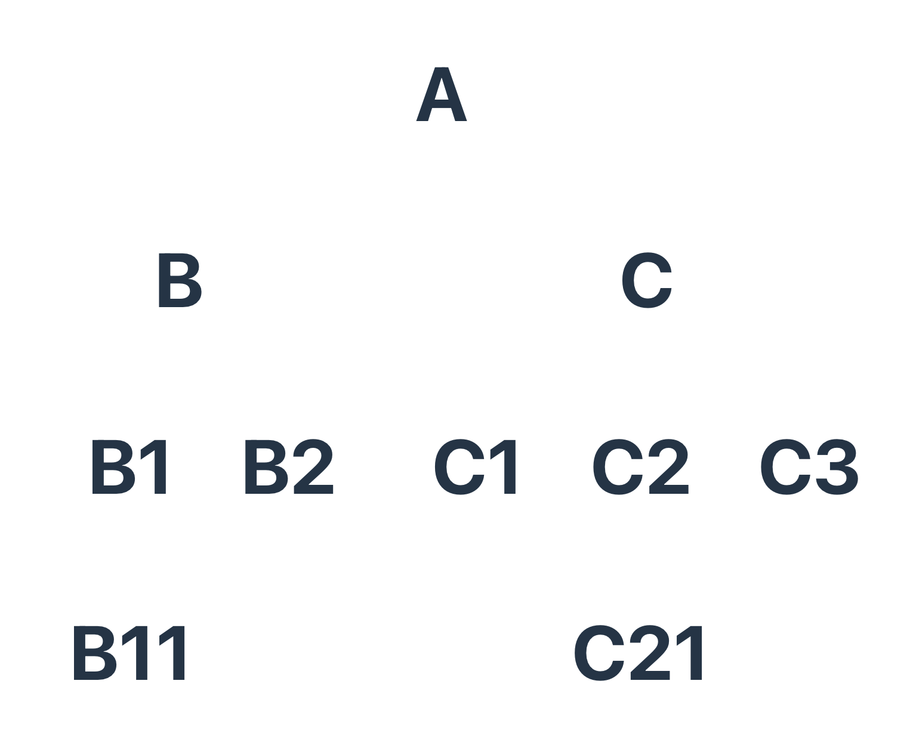

<h1 align="center">Welcome to react-context 👋</h1>
<p>
  
  <a href="https://twitter.com/Gorski_anthony" target="_blank">
    
  </a>
</p>

> Nous allons appréhender le contexte de React.
> Ce repo possèdera 2 branches. Une branche avec le système de props drilling et une branche avec le contexte.

### 🏠 Homepage



## Install

```sh
yarn install
# or
npm install
```

## Usage

```sh
yarn start
# or
npm start
```

## Author

👤 **Anthony Gorski**

-   Twitter: [@Gorski_Anthony](https://twitter.com/Gorski_Anthony)
-   GitHub: [@GorskiAnthony](https://github.com/GorskiAnthony)

## Show your support

Give a ⭐️ if this project helped you!

---

👋 Qui suis-je ?
Je suis **Anthony Gorski**, développeur web et formateur à la [Wild Code School](https://www.wildcodeschool.com/fr-FR).
